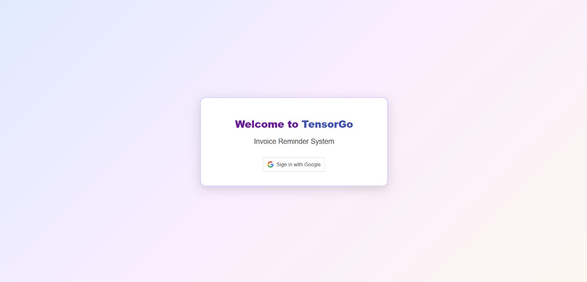
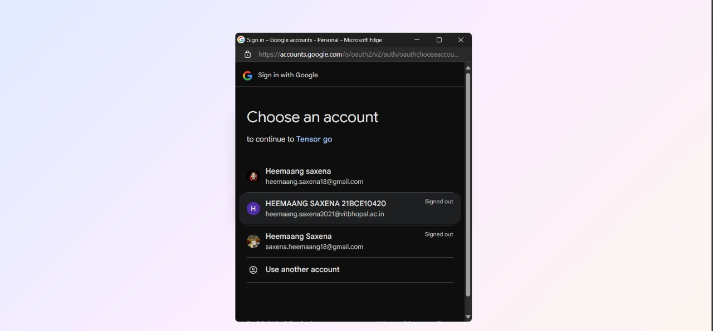
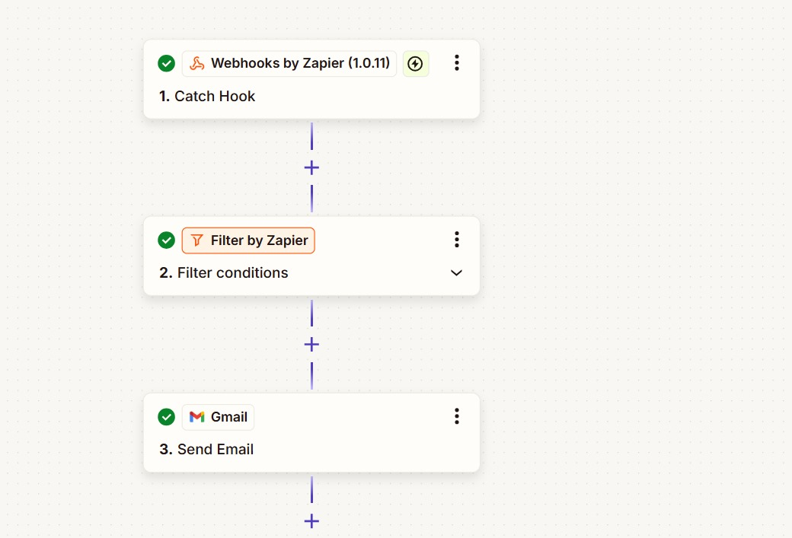
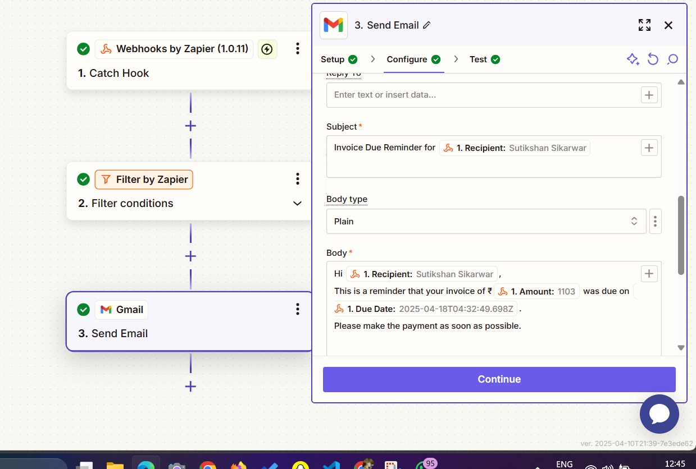
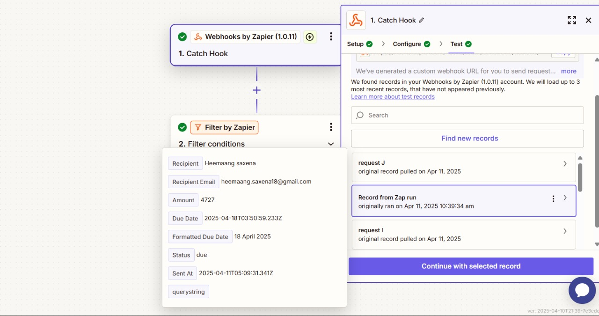

# 🧾 Invoice Reminder and Follow-up Automation with Zapier Integration

### 👨‍💻 Submitted by: Heemaang Saxena  
**Reg No:** 21BCE10420  
**Email:** heemaang.saxena18@gmail.com

---
## 🖼️ Screenshots

### 🏠 Home Page  


### 🔐 Google Auth  


### 📊 Invoice Dashboard  


### ⚙️ Zapier Trigger  


### 📧 Zapier Email Logic  


### 🔍 Zapier Filter Logic  


### 🧠 Zapier Overall Logic  



## ✅ Requirement Fulfillment

This project fulfills **all core requirements** and includes several **optional bonus features** from the assignment:

### 📌 Assignment Requirements Coverage

#### ✅ Backend Microservice (Node.js)
- [x] User authentication using Google OAuth
- [x] Fetch due invoice details (amount, due date, recipient)
- [x] API endpoint to trigger Zapier automation
- [x] Zapier integration for sending reminders & follow-ups

#### ✅ Frontend (React)
- [x] Google OAuth login UI
- [x] Display list of due invoices
- [x] Manual "Trigger Reminder" button for each invoice

#### ✅ Zapier Integration
- [x] Webhook communication from backend to Zapier
- [x] Email reminders triggered on invoice status
- [x] Filter for status = "due" and dynamic email content

#### ✨ Additional Features (Bonus)
- [x] Invoice auto-seeding for new users
- [x] Dynamic email templates with due date, name, amount
- [x] Logout functionality
- [x] Route protection and session check
- [x] Real-time feedback on trigger success/failure

---

## 📚 Project Overview

A full-stack application for automating invoice reminders using Zapier, with secure login, real-time dashboard, and email notification capabilities.

### 🔧 Technologies Used

- **Frontend**: React (Vite)
- **Backend**: Node.js, Express.js
- **Database**: MongoDB
- **Auth**: Passport.js (Google OAuth)
- **Automation**: Zapier Webhooks

---

## ⚙️ Setup Instructions

### 1. Clone the Repository

```bash
git clone https://github.com/heemaang/Tensor-Go-Assgiment.git
cd invoice-reminder-zapier
```

### 2. Backend Setup

```bash
cd server
npm install
```

Create `.env` file inside `server`:

```env
PORT=5000
MONGO_URI=mongodb://localhost:27017/invoicer
SESSION_SECRET=your-session-secret
GOOGLE_CLIENT_ID=your-google-client-id
GOOGLE_CLIENT_SECRET=your-google-client-secret
ZAPIER_WEBHOOK_URL=https://hooks.zapier.com/hooks/catch/your-webhook-id
```

Start server:

```bash
npm start
```

### 3. Frontend Setup

```bash
cd client
npm install
```

Create `.env` file inside `client`:

```env
VITE_GOOGLE_CLIENT_ID=your-google-client-id
```

Run frontend:

```bash
npm run dev
```

Now visit: [http://localhost:5173](http://localhost:5173)

---

## ⚡️ Zapier Integration Setup

1. Go to [Zapier](https://zapier.com)

2. Create a new Zap:
   - **Trigger**: Webhooks by Zapier → Catch Hook
   - **Action**: Gmail / Mailjet → Send Email

3. Copy the webhook URL and paste it in your `.env`:

```env
ZAPIER_WEBHOOK_URL=https://hooks.zapier.com/hooks/catch/your-webhook-id
```

4. Add filter: `status = due`

5. Set dynamic fields: `recipient`, `amount`, `due date`

---

## 🔄 App Flow

- User logs in using Google OAuth
- A sample invoice is auto-seeded if none exists
- User sees a dashboard with a list of due invoices
- Clicking "Trigger Reminder" calls the backend → Zapier
- Zapier sends a dynamic email reminder

---

## 📡 API Endpoints

| Method | Endpoint             | Description                           |
|--------|----------------------|---------------------------------------|
| GET    | /api/invoices        | Fetch all invoices                    |
| GET    | /api/me              | Get logged-in user info               |
| POST   | /api/init-user       | Create sample invoice for user        |
| POST   | /api/trigger-zapier  | Send invoice to Zapier webhook        |
| GET    | /logout              | Logout and destroy session            |

---

## 🧪 Testing Tools

- ✅ **Postman**: for backend API testing
- ✅ **Browser DevTools**: to check cookies & sessions
- ✅ **Zapier Task History**: to confirm email delivery
- ✅ **Console logs**: for frontend/backend feedback

---
